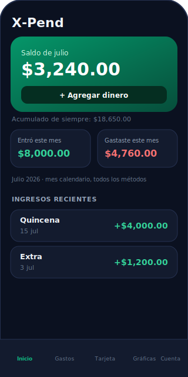
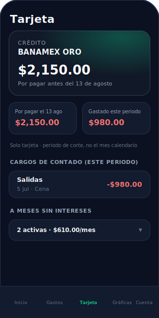

# X-Pend

Control de gastos personal. Vive instalada en tu iPhone como app (PWA), corre 100% local sin conexión, y se respalda solo en la nube cuando hay internet.

<p>
  
  
  
  
  
</p>

<p float="left">
  
  
</p>

> Los mockups de arriba usan datos ficticios — no son gastos reales de nadie.

## Qué hace

- **Inicio** — saldo del mes (se reinicia cada mes), acumulado histórico, y registro rápido de ingresos ("Agregar dinero")
- **Gastos** — registro por categoría (Comida, Salidas, Capricho, Pagos, Otro), método de pago (efectivo, débito, tarjeta), con soporte para compras a **meses sin intereses**
- **Tarjeta** — corte y fecha límite de pago configurables, separa cargos de contado del periodo abierto vs. lo que ya se factura y toca pagar, con acordeón para las compras a MSI y en qué cuota vas de cada una
- **Gráficas** — ingresos vs. gastos por mes, gasto por categoría, mejores/peores meses
- **Cuenta** — login sin contraseña (magic link) para respaldar todo en la nube; la app sigue funcionando sin internet igual que siempre

## Cómo está hecha

Es una **PWA** (Progressive Web App), no una app nativa de App Store — así evita la membresía de Apple Developer y vive gratis en Netlify. Instalada desde Safari ("Agregar a pantalla de inicio") se ve y se siente como una app nativa: ícono propio, pantalla completa, sin barra de navegador, funciona sin conexión.

**Local-first**: todos los datos viven en tu teléfono (IndexedDB vía [Dexie](https://dexie.org)) y la app funciona completa sin internet. Cuando hay sesión iniciada, cada cambio se sincroniza en segundo plano a [Supabase](https://supabase.com) como respaldo — si algún día reinstalas la app o cambias de teléfono, inicias sesión con el mismo correo y recuperas todo.

### Stack

| Parte | Tecnología |
|---|---|
| UI | React + Vite |
| Estilos | CSS plano, mobile-first |
| Animaciones | Framer Motion |
| Gráficas | Recharts |
| Datos locales | Dexie (IndexedDB) |
| Respaldo en la nube | Supabase (Postgres + Auth) |
| Instalación como app | `vite-plugin-pwa` (manifest + service worker) |
| Hosting | Netlify |

## Desarrollo

```bash
npm install
npm run dev
```

Para probarlo en tu celular durante desarrollo, entra desde Safari a `http://<ip-de-tu-compu>:5173` estando en la misma red WiFi.

### Variables de entorno

Crea un `.env.local` (no se sube al repo) con:

```
VITE_SUPABASE_URL=...
VITE_SUPABASE_ANON_KEY=...
```

### Build

```bash
npm run build
```

Genera `dist/` listo para desplegar en Netlify.
